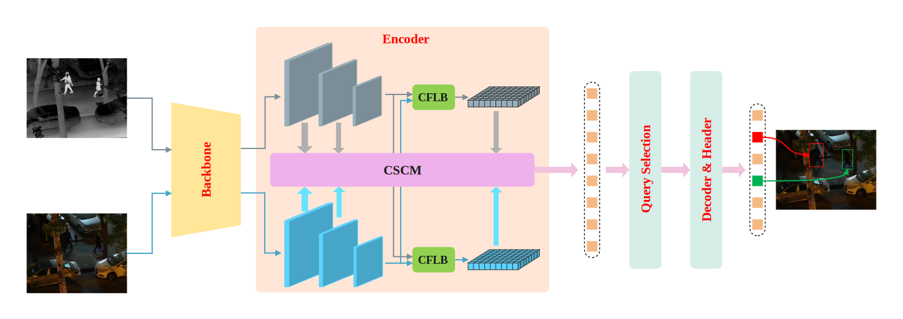

# Intro
This is the official implementation for [FEAR-DETR: Frequency-Enhanced and Retinex-Guided RGB-Thermal DEtection TRansformer with Joint Optimization]().

The complete code will be uploaded after the paper is accepted.

# Abstract
Multimodal object detection leverages the complementary information from RGB and thermal modalities to significantly enhance detection accuracy and robustness in complex environments. Nevertheless, prevailing approaches often inadequately address the intrinsic disparities between modalities during feature fusion, particularly under adverse illumination, while incurring substantial computational overhead. These limitations hinder their practical applicability. To overcome these challenges, we introduce FEAR-DETR, a novel real-time RGB-Thermal object detection framework, which pioneers the integration of low-quality image feature enhancement principles into multimodal detection. Specifically, we design a Cross Frequency-domain Light Balance module (CFLB) to refine high-level semantic features extracted by the backbone network and propose a Cross-Scale and Cross-Modal feature fusion Module (CSCM) for efficient fusion of multi-scale RGB and thermal features. Adopted a single-stream architecture, our FEAR-DETR achieves state-of-the-art performance on the public FLIR and LLVIP multimodal benchmark datasets while maintaining real-time efficiency.

# Overview


# Datasets
Please refer to:

- [a new aligned version of FLIR](https://github.com/DocF/multispectral-object-detection/blob/main/README.md)
- [LLVIP](https://github.com/bupt-ai-cz/LLVIP)

You need to convert the datasets to the COCO format. Refer to [this](https://github.com/PaddlePaddle/PaddleDetection/blob/release/2.7/docs/tutorials/data/PrepareDetDataSet.md#%E7%94%A8%E6%88%B7%E6%95%B0%E6%8D%AE%E8%BD%AC%E6%88%90coco%E6%95%B0%E6%8D%AE). It will involve the following scripts:

- datasets/LLVIP/get_txt.py
- tools/x2coco.py

# Installation
```bash
# paddlepaddle-gpu==2.6.2, CUDA==11.8, cuDNN==8.6.0
python -m pip install paddlepaddle-gpu==2.6.2 -i https://www.paddlepaddle.org.cn/packages/stable/cu118/

# clone repository and install
git clone https://github.com/Syqx1107/FEAR-DETR.git

pip install -r requirements.txt

pip install -v -e .
```

# run
train:

```bash
#flir
CUDA_VISIBLE_DEVICES=0 python tools/train.py -c configs/feardetr/feardetr_hgnetv2_x_5x_align_flir_v1_ir_X_class3_train1.yml --eval -o output_eval=logs/fear/flir_stage1 > logs/fear/train_stage1.log 2>&1 &

CUDA_VISIBLE_DEVICES=0 python tools/train.py -c configs/feardetr/feardetr_hgnetv2_x_5x_align_flir_v1_ir_X_class3_train1+2_from9.yml --eval -r output_fear/flir/feardetr_hgnetv2_x_5x_align_flir_v1_ir_X_class3_train1/9.pdparams > logs/fear/train_stage1+2_from9.log 2>&1 &

#llvip

```

val:

```bash
#flir
CUDA_VISIBLE_DEVICES=0 python tools/eval.py -c configs/feardetr/feardetr_hgnetv2_x_5x_align_flir_v1_ir_X_class3_train2.yml \
-o weights=output_fear/flir/feardetr_hgnetv2_x_5x_align_flir_v1_ir_X_class3_train2/best_model.pdparams output_eval=logs/fear/flir_stage2 > logs/fear/val_stage2.log 2>&1

#llvip
CUDA_VISIBLE_DEVICES=0 python tools/eval.py -c configs/feardetr/feardetr_hgnetv2_x_5x_align_flir_v1_ir_X_class3_train1+2.yml \
-o weights=output_fear/flir/feardetr_hgnetv2_x_5x_align_flir_v1_ir_X_class3_train1+2/best_model.pdparams > fear_val_stage1+2.log 2>&1
```

infer:

```bash
#flir
python tools/infer.py \
    -c configs/feardetr/feardetr_hgnetv2_x_5x_align_flir_v1_ir_X_class3_train1+2_from9.yml \
    -o weights=output_fear/flir/feardetr_hgnetv2_x_5x_align_flir_v1_ir_X_class3_train1+2_from9/best_model.pdparams \
    --dual_modal \
    --infer_img=your_rgb_img_path \
    --infer_img_modal2=your_thermal_img_path \
    --draw_threshold=0.5 \
    --save_results=False \
    --visualize=True \
    --output_dir=infer_output/flir/rgb-t

#llvip
python tools/infer.py \
    -c configs/feardetr/feardetr_hgnetv2_x_5x_LLVIP_ir_X_class1_train1+2_from9.yml \
    -o weights=output_fear/flir/feardetr_hgnetv2_x_5x_LLVIP_ir_X_class1_train1+2_from9/best_model.pdparams \
    --dual_modal \
    --infer_img=your_rgb_img_path \
    --infer_img_modal2=your_thermal_img_path \
    --draw_threshold=0.5 \
    --save_results=False \
    --visualize=True \
    --output_dir=infer_output/llvip/rgb-t
```

# Results
|     Methods     | Data  | Backbone |    FLIR    |            |               |   LLVIP    |            |               |
| :-------------: | :---: | :------: | :--------: | :--------: | :-----------: | :--------: | :--------: | :-----------: |
|                 |       |          | mAP$_{50}$ | mAP$_{75}$ | mAP$_{50:95}$ | mAP$_{50}$ | mAP$_{75}$ | mAP$_{50:95}$ |
|     RT-DETR     |  RGB  | HGNetV2X |    69.7    |    26.5    |     33.5      |    91.5    |    59.5    |     54.2      |
|     RT-DETR     |   T   | HGNetV2X |    80.5    |    39.6    |     43.6      |    97.3    |    78.4    |     67.9      |
| FEAR-DETR(Ours) | RGB-T | HGNetV2X |  **85.8**  |  **44.6**  |   **47.4**    |  **98.2**  |  **84.9**  |   **72.7**    |

# Reference

- [RT-DETR](https://github.com/lyuwenyu/RT-DETR)
- [multispectral-object-detection](https://github.com/DocF/multispectral-object-detection/tree/main)
- [PaddleDetection](https://github.com/PaddlePaddle/PaddleDetection/tree/release/2.6)

# Citation

Not available for now